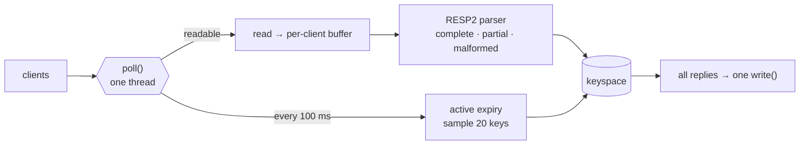
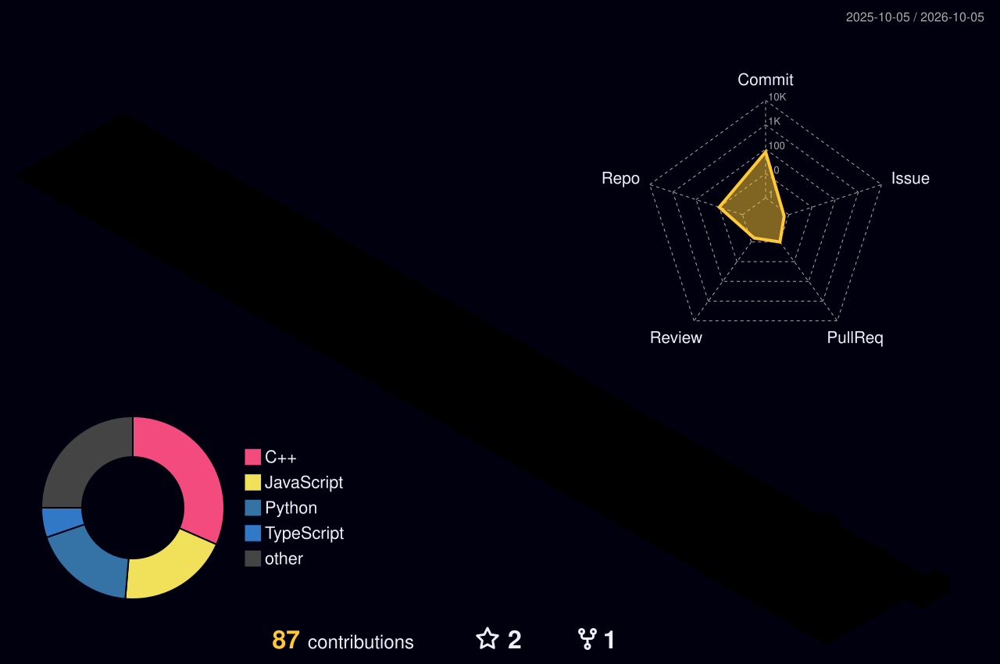

<div align="center">


[](https://www.kratix.in)
[](https://www.linkedin.com/in/kratik-jain-015629229/)
[](mailto:kratikjain1520@gmail.com)
<br/>
[](https://codeforces.com/profile/kratikjain1520)
[](https://www.codechef.com/users/kratikjain1520)


</div>

```console
kratik@arch:~$ whoami
backend engineer · C++ first · NIT Surat '25 (ECE)

kratik@arch:~$ cat interests.txt
sockets · event loops · wire protocols · CPU pipelines · making slow things fast

kratik@arch:~$ ls ~/learning
java/  spring-boot/
```

---

## 🧱 Things I've built

### ⚡ [Onyx](https://github.com/KratikJain10/onyx) · Redis-compatible server in C++17

No libraries, just POSIX sockets. Point `redis-cli` at it and it works. One thread, a `poll()` event loop, an incremental RESP2 parser that handles partial, pipelined and malformed input, and Redis-style lazy + sampled active key expiry.

<table>
<tr>
<td align="center"><h3>~1M</h3><sub>req/s pipelined</sub></td>
<td align="center"><h3>~68K</h3><sub>req/s unpipelined</sub></td>
<td align="center"><h3>&lt;1.7 ms</h3><sub>p99 latency</sub></td>
<td align="center"><h3>0</h3><sub>dependencies</sub></td>
<td align="center"><h3>≈ Valkey 9.1</h3><sub>same machine</sub></td>
</tr>
</table>



<details>
<summary><b>🐛 The bug the benchmark found: pipelining made it 4× slower</b></summary>
<br/>

```text
pipelined, before   ▏ 18K req/s
unpipelined         ███ 68K req/s
pipelined, after    ████████████████████████████████████████████ ~1M req/s
```

Every batch took ~43 ms, whatever its size. The server wrote each reply separately, so **Nagle's algorithm** held back each small write until the previous one was ACKed, while the client **delayed its ACK** waiting for more data. Both sides politely waiting on each other, ~40 ms at a time.

Fix: batch each read's replies into **one `write()`** and set **`TCP_NODELAY`**. **18K → ~1M req/s.** [Full numbers and method →](https://github.com/KratikJain10/onyx#performance)

</details>

<table>
<tr>
<td width="50%" valign="top">

### 🧠 [RISC-V CPU](https://github.com/KratikJain10/RISC-V-Processor)
**RV32IM, 5-stage pipeline, in Verilog**

Built from scratch and run on a Basys-3 (Artix-7) FPGA. Scoreboard-based issue, operand forwarding, a pipelined multiplier and an iterative divider. Plus a Python/Bash/TCL regression flow that assembles tests and runs them through Vivado automatically.


</td>
<td width="50%" valign="top">

### 💬 [Just-Chat](https://github.com/KratikJain10/Just-Chat)
**Real-time chat, MERN + Socket.IO**

Instant messaging over WebSockets, JWT auth with bcrypt-hashed passwords, online presence, conversations stored in MongoDB.


</td>
</tr>
<tr>
<td width="50%" valign="top">

### 🎨 [GingerArt](https://github.com/KratikJain10/GingerartSite)
**GWoC 2023**

Production website for GingerArt, a startup out of SVNIT Surat.


</td>
<td width="50%" valign="top">

### 🔭 Up next

- **Onyx:** output buffering on `POLLOUT`, RDB snapshots, `DEL` / `EXPIRE` / `TTL`
- **Java + Spring Boot:** building something real with it
<!-- VELOX: when it reaches Stage 5 and the repo is public, replace the line above with:
- 🚕 **[Velox](https://github.com/KratikJain10/velox):** ride-hailing backend, Java · Spring Boot. <one line + one measured number>
-->

</td>
</tr>
</table>

---

## 🛠️ Toolbox

<div align="center">


<br/>


</div>

---

## 📊 Activity

<div align="center">



<picture>
  <source media="(prefers-color-scheme: dark)" srcset="https://raw.githubusercontent.com/KratikJain10/KratikJain10/output/github-snake-dark.svg" />
  <source media="(prefers-color-scheme: light)" srcset="https://raw.githubusercontent.com/KratikJain10/KratikJain10/output/github-snake.svg" />
  
</picture>

</div>


