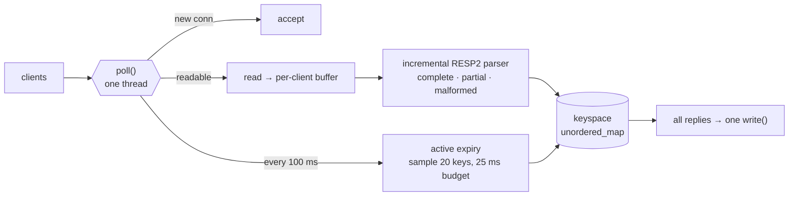

<div align="center">


<br/>

[](https://www.kratix.in)
[](https://www.linkedin.com/in/kratik-jain-015629229/)
[](https://codeforces.com/profile/kratikjain1520)
[](https://www.codechef.com/users/kratikjain1520)
[](mailto:kratikjain1520@gmail.com)

</div>

```cpp
struct Kratik {
    const char* role      = "backend engineer";
    const char* main_lang = "C++";
    const char* also      = "C, Linux, SQL, Node.js/Express";
    const char* learning  = "Java";
    const char* likes     = "sockets, event loops, protocols, finding where the time goes";
    const char* runs      = "Arch, btw";
};
```

---

## ⚡ [Onyx](https://github.com/KratikJain10/onyx) — a Redis-compatible server, from scratch

C++17 on raw POSIX sockets. **Zero dependencies.** Point any Redis client at it and it just works.

```console
$ ./build-release/onyx &
$ valkey-cli -p 6379 SET greeting "hello world" PX 5000
OK
$ valkey-cli -p 6379 GET greeting
"hello world"
```

**How it works**



- **Single-threaded `poll()` event loop** — replaced my first thread-per-client version; no locks, every command atomic
- **Incremental RESP2 parser** — partial, pipelined and malformed input; binary-safe keys and values
- **Redis-style expiry** — lazy on read + sampled active expiry, on a monotonic clock

**Benchmarks** (`valkey-benchmark`, 1M requests, 50 clients, same machine as Valkey 9.1)

| | Onyx | Valkey 9.1 |
|---|---:|---:|
| `SET`, pipelined `-P 16` | **965K req/s** | 699K req/s |
| `PING`, pipelined `-P 16` | **1.01M req/s** | 1.01M req/s |
| `GET`, one request in flight | **67K req/s** | 68K req/s |

Comparable to Valkey, not "faster than Valkey": Valkey does far more per command. [All numbers + method →](https://github.com/KratikJain10/onyx#performance)

### 🐛 The bug the benchmark found

```text
pipelined, before   ▏ 18K req/s
unpipelined         ███ 68K req/s
pipelined, after    ████████████████████████████████████████████ ~1M req/s
```

Pipelining made it **4× slower**. Every batch took ~43 ms, whatever its size. The server wrote each reply separately, so **Nagle** held back each small write until the last one was ACKed, while the client **delayed its ACK** waiting for more. A polite TCP deadlock, ~40 ms at a time.

Fix: batch each read's replies into **one `write()`** and set **`TCP_NODELAY`**. **18K → ~1M req/s.**

<!-- VELOX: uncomment when it reaches Stage 5 (and the repo is public)
### 🚕 [Velox](https://github.com/KratikJain10/velox) — ride-hailing backend

Java · Spring Boot. <one line on what it does + one real, measured number>
-->

---

## 🛠️ Stack

<div align="center">


<br/>


</div>

---

<div align="center">

<picture>
  <source media="(prefers-color-scheme: dark)" srcset="https://raw.githubusercontent.com/KratikJain10/KratikJain10/output/github-snake-dark.svg" />
  <source media="(prefers-color-scheme: light)" srcset="https://raw.githubusercontent.com/KratikJain10/KratikJain10/output/github-snake.svg" />
  
</picture>

<sub>NIT Surat '25 · ECE · ships C++ that talks TCP</sub>

</div>


