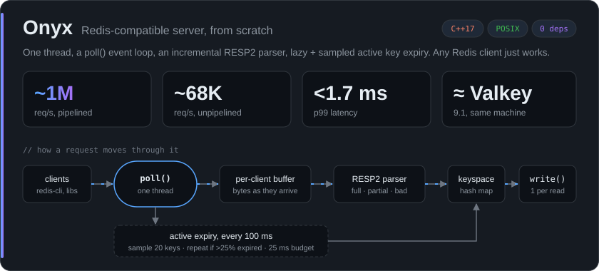
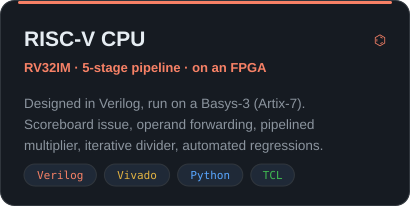
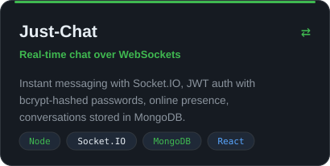
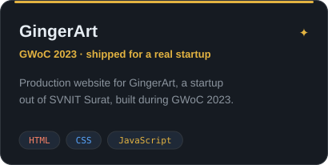
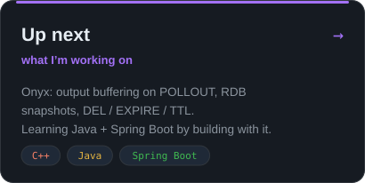

<p align="center">
  
</p>

<p align="center">
  <a href="https://www.kratix.in"></a>
  <a href="https://www.linkedin.com/in/kratik-jain-015629229/"></a>
  <a href="mailto:kratikjain1520@gmail.com"></a>
  <a href="https://codeforces.com/profile/kratikjain1520"></a>
  <a href="https://www.codechef.com/users/kratikjain1520"></a>
</p>

<br/>

<a href="https://github.com/KratikJain10/onyx"></a>

<details>
<summary><b>The bug the benchmark found: pipelining made Onyx 4× <i>slower</i></b></summary>
<br/>

```text
pipelined, before   ▏ 18K req/s
unpipelined         ███ 68K req/s
pipelined, after    ████████████████████████████████████████████ ~1M req/s
```

Every batch took ~43 ms, whatever its size. The server wrote each reply separately, so **Nagle's algorithm** held back each small write until the previous one was ACKed, while the client **delayed its ACK** waiting for more data. Both sides politely waiting on each other, ~40 ms at a time.

Fix: batch each read's replies into **one `write()`** and set **`TCP_NODELAY`**. **18K → ~1M req/s.** [Full numbers and method →](https://github.com/KratikJain10/onyx#performance)

</details>

<br/>

<p align="center">
  <a href="https://github.com/KratikJain10/RISC-V-Processor"></a>
  <a href="https://github.com/KratikJain10/Just-Chat"></a>
</p>
<p align="center">
  <a href="https://github.com/KratikJain10/GingerartSite"></a>
  
</p>
<!-- VELOX: when it reaches Stage 5 and the repo is public, add assets/velox.svg
     (same style as the cards above) and swap it in for next.svg. -->

<br/>

<p align="center">
  
</p>
